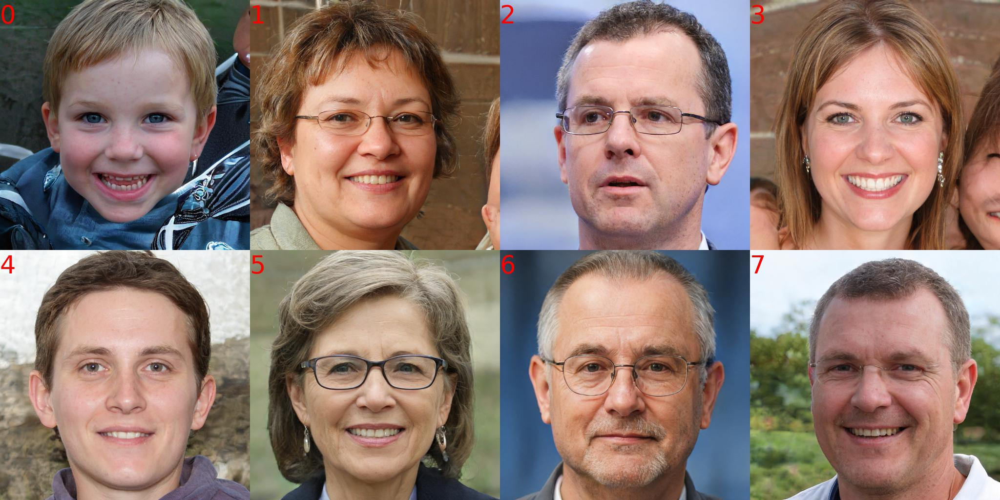
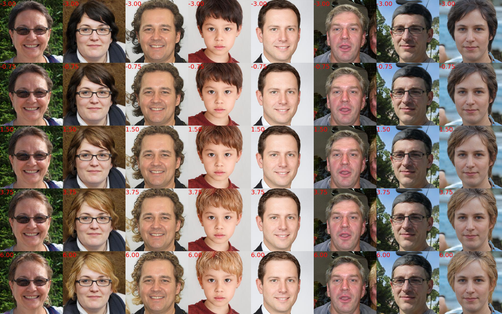
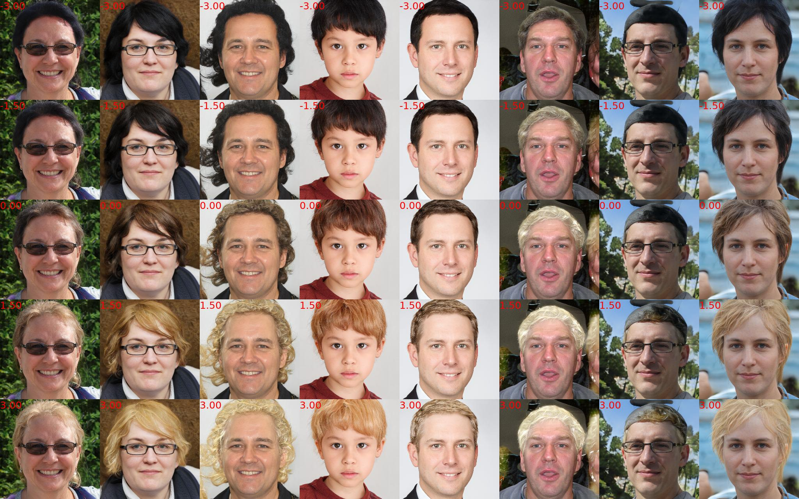

# Control-Units-in-StyleGAN2

[Project](https://wrong.wang/x/Control-Units-in-StyleGAN2/) | [Paper](https://dl.acm.org/doi/10.1145/3474085.3475274)

The official PyTorch implementation for MM'21 paper 'Attribute-specific Control Units in StyleGAN for Fine-grained Image Manipulation'


## Pretrained Models

We provide the pretrained StyleGAN2 generator, face parser, attribute classifier and e4e encoder in the following link.

[Google Drive](https://drive.google.com/drive/folders/1g-ukOZ_KZXHSroLXq87jTx7iTlIinhzf?usp=sharing)

Please download the pre-trained StyleGAN2 generator at least. Put the models in `./pretrained`.

Now, the structure  folder `pretrained` maybe looks like:


```text
$ tree ./pretrained
./pretrained/
|-- Attribute_CelebAMask-HQ_40_classifier.pth
|-- BiSetNet.pth
|-- correction.pt
|-- e4e_ffhq_encode.pt
|-- modifications
|   |-- before_Bushy_Eyebrows_s_123,315,325.mdfc
|   |-- before_alter_Black_Hair_12.mdfc
|   |-- before_alter_Blond_Hair_12.mdfc
|   `-- before_single_channel_11_286.mdfc
`-- stylegan2-ffhq-config-f.pt
```


## Set up the environment

Detailed setup information can be found in [environment](documents/environment.md).

We also provide the [environment.yml](environment.yml) as a reference. In general, make sure the gcc version is new enough, and all other packages can be installed via conda or pip.

## Test

Let's get started quickly:

```bash
python3 manipulation.py test ./pretrained/modifications/before_alter_Black_Hair_12.mdfc --max_factor 20
```

This command will save the editing results in `./tmp`:

```text
$ tree ./tmp
tmp
|-- before_alter_Black_Hair_12_mdfc0_batch0.jpg
`-- before_alter_Black_Hair_12_mdfc0_batch0_diff.jpg
```

The image named as `{mdfc_file_name}_{mdfc_id}_{batch_id}.jpg` is the generated manipulated grid image, and the `{mdfc_file_name}_{mdfc_id}_{batch_id}_diff.jpg` is the manipulated error image.

`{mdfc_file_name}_{mdfc_id}_{batch_id}.jpg`:


`{mdfc_file_name}_{mdfc_id}_{batch_id}_diff.jpg`:


Then, you can test other `*.mdfc` in `./pretrained/modifications`.

## Create the modification for attributes

For simplicity, let us create a new modification using a small number of positive and negative samples.

Take the attribute `Blond_Hair` as an example. We will try to find the control units for this attribute, and the modification that can change the hair color.

### open a python shell, run the following command to create a latent bank.

```python
import torch
torch.manual_seed(0)
torch.save(torch.randn(8, 512), "seed.z")
```

### generate the images corresponding to the latent.

```
python3 manipulation.py generate --num_samples 8 --batch_size 8 --separately 0 --latent_path ./seed.z --captions
```

This command will save the image `b0.jpg` in the `./tmp`.

### determine which ones to use as positive or negative samples.

The generated images are saved as `./tmp/b0.jpg`, check it and determine which image can be used as positive sample.



we select `0,1,3` as the positive samples, and `4,2,6,7` for the negative.

### generate the manipulated result only with the style vector movement.

we now calculate the mean of the positive latents and negative latents (in the S space). Then move the modulation style along the direction:

```python
python3 manipulation.py test --batch_size 8 --seed 1 --num_samples 16  --resize 256 --save_type grid \
--start_factor -3 --max_factor 6 --num_factors 5 \
--build_mdfc_way paired_delta \
--latent1 ./seed.z --ids1   0,1,3  \
--latent2 ./seed.z  --ids2 4,2,6,7  \
--layers 12 --rules "(ric[10]>0.2)"
```

`latent1` & `ids1` specify the positive latent, and `latent2` & `ids2` for negative latent.

`layers` means the layer index, and `--rules "(ric[10]>0.2)"` means we select the channels that the correction to the region `hair` is greater than 0.2 .

```python
# region id mapping
# ("<region_name>", <list_of_segmentation_label_id>) # region_id
SEMANTIC_REGION = dict(
    [
        ("background", (0,)),  # 0
        ("brow", (1, 2)),  # 1
        ("eye", (3, 4)),  # 2
        ("glass", (5,)),  # 3
        ("ear", (6, 7, 8)),  # 4
        ("nose", (9,)),  # 5
        ("mouth", (10,)),  # 6
        ("lips", (11, 12)),  # 7
        ("neck", (13, 14)),  # 8
        ("cloth", (15,)),  # 9
        ("hair", (16,)),  # 10
        ("hat", (17,)),  # 11
        ("face_up", (18,)),  # 12
        ("face_middle", (19,)),  # 13
        ("face_down", (20,)),  # 14
    ]
)
```

Here is the result:



### save the modificaton as the mdfc file

```python
# just copy the cli arguments for the about command
PYTHONPATH=. python3 editing/modification.py paired_delta \
--latent1 ./seed.z --ids1   0,1,3  \
--latent2 ./seed.z  --ids2 4,2,6,7  \
--layers 12 --rules "(ric[10]>0.2)"
```

Then change the ugly default name:

```bash
mv "tmp/alter_paired_delta_seed_(0, 1, 3)_seed_(4, 2, 6, 7).mdfc" tmp/Blond_Hair.mdfc
```

### Optimizate to find the style vector for manipulating feature maps

```bash
PYTHONPATH=. python3 ./tools/manipulation/enhance.py prev tmp/Blond_Hair.mdfc 10 \
 --checkpoint pretrained/stylegan2-ffhq-config-f.pt \
 --batch_size 4 --num_batch 1000

# test new mdfc
python3 manipulation.py test ./tmp/before_Blond_Hair.mdfc --batch_size 8 --seed 1 --num_samples 16  --resize 256 --save_type grid --start_factor -3 --max_factor 3 --num_factors 5 --another_factor 0.8
```

The result of full modification to control units:




# Citation

If you use this code for your research, please cite our paper [Attribute-specific Control Units in StyleGAN for Fine-grained Image Manipulation
](https://dl.acm.org/doi/10.1145/3474085.3475274)

```text
@inproceedings{10.1145/3474085.3475274,
author = {Wang, Rui and Chen, Jian and Yu, Gang and Sun, Li and Yu, Changqian and Gao, Changxin and Sang, Nong},
title = {Attribute-Specific Control Units in StyleGAN for Fine-Grained Image Manipulation},
year = {2021},
isbn = {9781450386517},
publisher = {Association for Computing Machinery},
address = {New York, NY, USA},
url = {https://doi.org/10.1145/3474085.3475274},
doi = {10.1145/3474085.3475274},
booktitle = {Proceedings of the 29th ACM International Conference on Multimedia},
pages = {926–934},
numpages = {9},
keywords = {generative adversarial networks(GANs), control unit, image manipulation},
location = {Virtual Event, China},
series = {MM '21}
}

```
