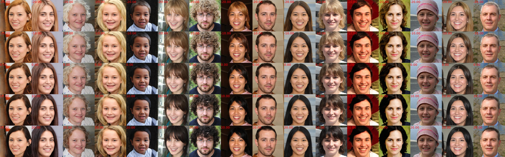
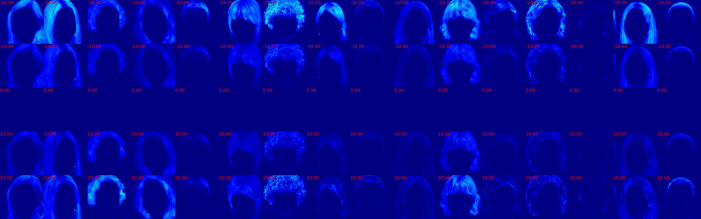

# Control-Units-in-StyleGAN2

[Project](https://wrong.wang/x/Control-Units-in-StyleGAN2/) | [Paper](https://dl.acm.org/doi/10.1145/3474085.3475274)

The official PyTorch implementation for MM'21 paper 'Attribute-specific Control Units in StyleGAN for Fine-grained Image Manipulation'


## Pretrained Models

We provide the pretrained StyleGAN2 generator, face parser, attribute classifier and e4e encoder in the following link.

[Google Drive](https://drive.google.com/drive/folders/1g-ukOZ_KZXHSroLXq87jTx7iTlIinhzf?usp=sharing)

Please download the pre-trained StyleGAN2 generator at least. Put the models in `./pretrained`.

Now, the structure  folder `pretrained` maybe looks like:


```bash
$ tree ./pretrained
./pretrained/
|-- Attribute_CelebAMask-HQ_40_classifier.pth
|-- BiSetNet.pth
|-- correction.pt
|-- e4e_ffhq_encode.pt
|-- modifications
|   |-- before_Bushy_Eyebrows_s_123,315,325.mdfc
|   |-- before_alter_Black_Hair_12.mdfc
|   |-- before_alter_Blond_Hair_12.mdfc
|   `-- before_single_channel_11_286.mdfc
`-- stylegan2-ffhq-config-f.pt
```


## Set up the environment

Detailed setup information can be found in [environment](documents/environment.md).

We also provide the [environment.yml](environment.yml) as a reference. In general, make sure the gcc version is new enough, and all other packages can be installed via conda or pip.

## Test

Let's get started quickly:

```bash
python3 manipulation.py test ./pretrained/modifications/before_alter_Black_Hair_12.mdfc --max_factor 20
```

This command will save the editing results in `./tmp`:

```bash
$ tree ./tmp
tmp
|-- before_alter_Black_Hair_12_mdfc0_batch0.jpg
`-- before_alter_Black_Hair_12_mdfc0_batch0_diff.jpg
```

The image named as `{mdfc_file_name}_{mdfc_id}_{batch_id}.jpg` is the generated manipulated grid image, and the `{mdfc_file_name}_{mdfc_id}_{batch_id}_diff.jpg` is the manipulated error image.

`{mdfc_file_name}_{mdfc_id}_{batch_id}.jpg`:



`{mdfc_file_name}_{mdfc_id}_{batch_id}_diff.jpg`:




# Citation

If you use this code for your research, please cite our paper [Attribute-specific Control Units in StyleGAN for Fine-grained Image Manipulation
](https://dl.acm.org/doi/10.1145/3474085.3475274)

```text
@inproceedings{10.1145/3474085.3475274,
author = {Wang, Rui and Chen, Jian and Yu, Gang and Sun, Li and Yu, Changqian and Gao, Changxin and Sang, Nong},
title = {Attribute-Specific Control Units in StyleGAN for Fine-Grained Image Manipulation},
year = {2021},
isbn = {9781450386517},
publisher = {Association for Computing Machinery},
address = {New York, NY, USA},
url = {https://doi.org/10.1145/3474085.3475274},
doi = {10.1145/3474085.3475274},
booktitle = {Proceedings of the 29th ACM International Conference on Multimedia},
pages = {926–934},
numpages = {9},
keywords = {generative adversarial networks(GANs), control unit, image manipulation},
location = {Virtual Event, China},
series = {MM '21}
}

```
